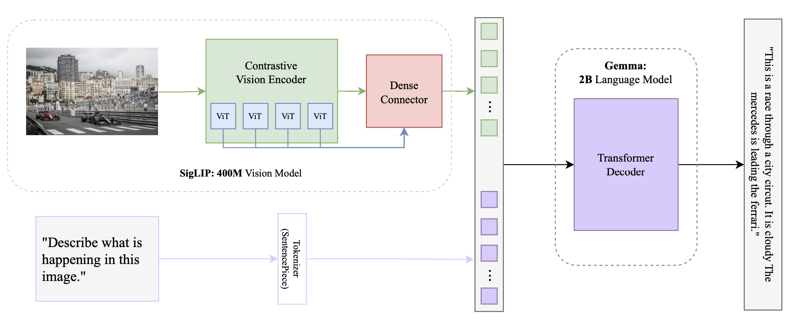
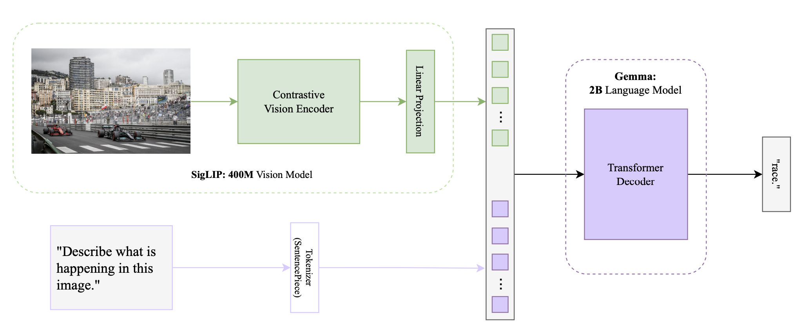
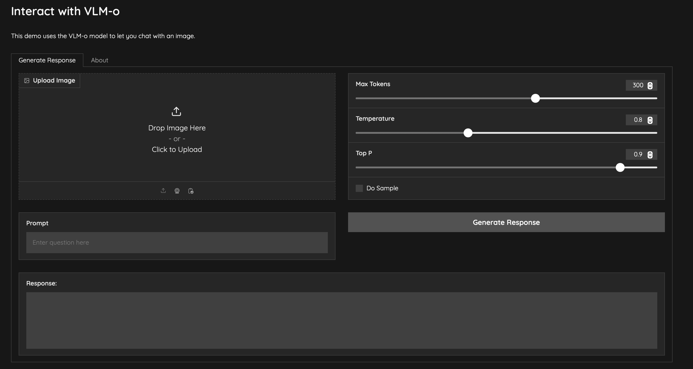

# VLM-o

VLM-o is a 3B parameter multi-modal vision model built for image analysis and object detection. This model is inspired by the [PaliGemma](https://arxiv.org/pdf/2407.07726) architecture. To read my kinda technical report, check out my [blog post](https://vpareek2.github.io/blogs/posts_html/blog2.html).

This repository contains an inference implementation written in [PyTorch](https://pytorch.org). The weights are used from HuggingFace's [PaliGemma-3b-pt-224](https://huggingface.co/google/paligemma-3b-pt-224) repository and then fine-tuned using [LoRA](https://arxiv.org/pdf/2106.09685) on the [VQA2](https://visualqa.org) dataset. There are 2 implementations in this repository, one vanilla implementation based on the PaliGemma Architecture, and one where a Dense Connector is introduced in place of the Linear Layer. Look below at [Model Architecture](#model-architecture) for an important note. The two architectures are below.

<div align="center">

**VLM-o Dense Connector**  


</div>
<br>
<div align="center">

**VLM-o PaliGemma**  


</div>

## Quick start

### Installation

1.  To install VLM-o you need to use Python 3.10 or higher.

2.  Clone the repository using:
```
https://github.com/vpareek2/vlm-o
```

#### Downloading the model
3. To run inference on this implementation, you need to download the weights from huggingface at https://huggingface.co/google/paligemma-3b-pt-224. I am probably going to upload my fine-tuned weights too, I will update this when I do. If you want them, feel free to reach out, I am not sure how to upload them right now, huggingface is glitching. Once you are on huggingface, and logged into your account, clone the weights into the same VLM-o repository.

4. Make sure to download all libraries using the requirements.txt file.

```
pip install -r requirements.txt
```

5. Adjust any hyperparameters prompt in the run.sh file. Also add whatever test images you want to into the test_images file.

6. Inference the model by running the command:
```
./run.sh
```

### Demo and GUI use
If you prefer to use the model with a graphical user interface, I have designed a pretty simple gradio app. Originally this was supposed to be added to my personal website, but I didn't really want to pay and couldn't get enough vram at any free tier.

All you have to do is first unzip the weights.zip folder, then run:
```
python app.py
```
Then open the local host link in the browser of your choice. It should look like this:




## Model Architecture
In this repository there are 2 folders with model architectures, model and dc_model. model is the file that contains the vanilla implementation of VLM-o, mainly following the PaliGemma architecture. model_dc contains the implementation with a dense connector used in the MultiModalProjector. By default, this repository and `run.sh` is using the PaliGemma implementation. To run the dense connector implementation, navigate into the run.sh file, and where it says `inference.py` in line 13, change it to `inference_dc.py`. If you would like to do the demo, go into app.py and adjust line 5, `from inference import test_inference` to `from inference_dc import test_inference`.

While the dense connector can provide better accuracy and better responses, there responses vary a lot with hallucinations, or just blank responses. I will write more about this in my blog post which I will link. For a more robust model, with reliable outputs use the vanilla model. 

## System Requirements

VLM-o can run using the CPU, GPU, or MPS (Mac Performance Shaders for M-Series chips). I haven't done real benchmarking but based on my tests it can inference in ~ 15 seconds from CPU, ~ 7 seconds from GPU and ~ 10 seconds from MPS, using a M2 Max chip for CPU/MPS and a 3070 for GPU.

## Contributing

I am open to any bug reports or contributions. I know there are a lot of parts that can be improved here, but I don't think I will advance from here as I have a larger project to work on, this was more of a weekend project. I haven't done much parameter tuning so that is a big point of improvement

## Project Notes & Inspiration
This project was inspired by a youtube video I found [here](https://www.youtube.com/watch?v=vAmKB7iPkWw) by Umar Jamil. I am still new to implementing papers so I decided to work on one which had been done before. You will probably see major differences in our codebases, but for the RotaryEmbeddings and KVCache, I referenced his videos, which explained it very well. I highly recommend the video. 

A note about this project is due to limited compute (me making this on my laptop and being a college student) I was only able to fine-tune on 10% of the VQA2 dataset. This had some interesting repercussions because the model became very blunt. When you ask a question: What is happening in the picture, answer: race. Or diving. For the two test examples at least. The original weights provide a lot more description but, it is not instruction tuned so you can't ask a question and expect a response. 

## References
[PaliGemma Paper](https://arxiv.org/pdf/2407.07726)<br>
[LoRA Paper](https://arxiv.org/pdf/2106.09685)<br>
[SigLip Paper](https://arxiv.org/pdf/2303.15343)<br>
[Attention Paper](https://arxiv.org/pdf/1706.03762)<br>
[Dense Connector Paper](https://arxiv.org/pdf/2405.13800), and [repository](https://github.com/HJYao00/DenseConnector?tab=readme-ov-file)<br>
[YouTube Video](https://www.youtube.com/watch?v=vAmKB7iPkWw)

